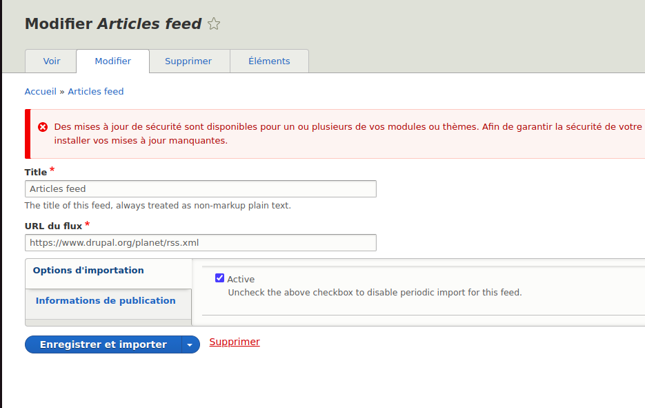

The following guide will help you first installing or updating the project

## Installation

To install the project :

1. git clone
2. cd fidesio
3. Set up your environment variable in .env file situated in root project.
4. **docker-compose up -d** to build and run all the requirements of the project
5. **docker-compose exec php bash** to run php container
6. Inside PHP container run **composer install** : this will install Drupal and all the dependencies of the project.
7. Copy the file ./sites/default/default.settings.php to ./sites/default/settings.php
8. Update Settings.php created with you database credentials (the same as in .env file)

Import the database: (To get the feed content created)

Inside the php container:
- mysql -u user -p database-name<dump.sql

Synchronize the configuration:

Inside the php container:
- cd web/
- drush cim -y

 ************************ Les choix techniques ************************

1/ Pour importer le flux rss, le module Feeds est utilisé avec une configuration d'import avec URL

2/ Pour déclencher l'import 6h chaque matin, plusieurs solutions sont possibles, parmi ces solutions : 

- Utiliser le crontab et lancer la commande drush d'import de feed ou un cron personnalisé
- Utiliser le module Ultimate cron avec la config crontab (la solution que j'ai utilisé)

3/ Pour la page de recherche j'ai utilisé les modules search api / module facets pour afficher le checkbox des tags

